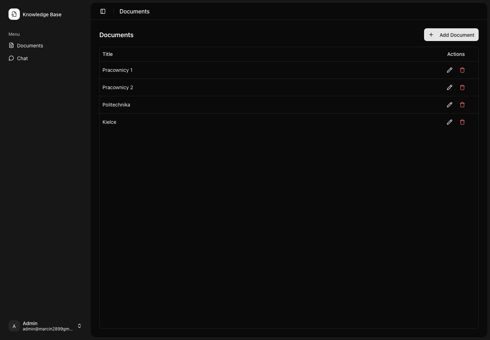
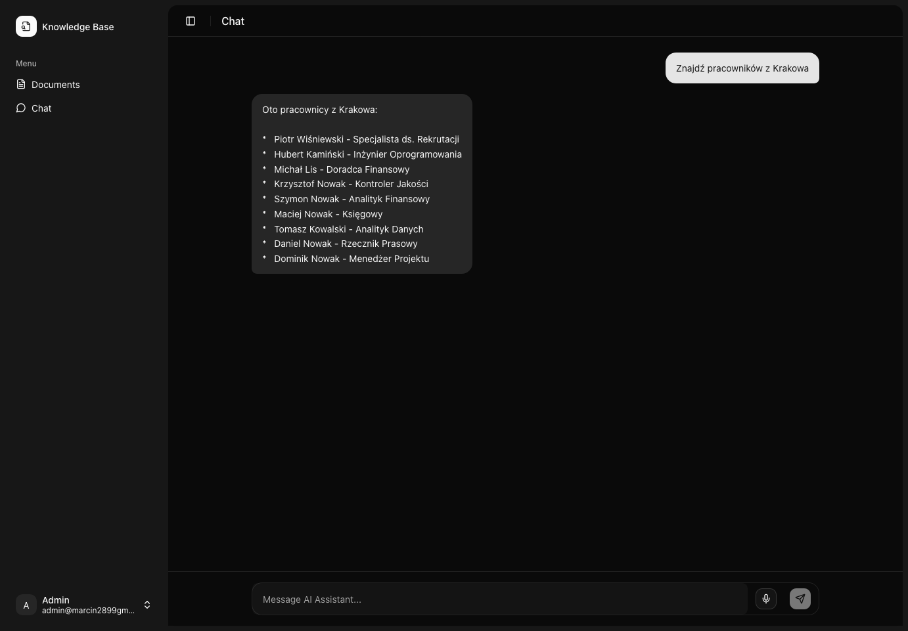

# Knowledge Base (RAG)

## Zespół:
- Marcin Konwiak
- Michał Konwiak

## Opis projektu

Aplikacja Knowledge Base to system do zarządzania wiedzą organizacyjną z wykorzystaniem sztucznej inteligencji. Głównym celem projektu było stworzenie narzędzia umożliwiającego pracownikom szybkie wyszukiwanie informacji z dokumentów poprzez chatbot AI.

### Główne funkcjonalności:
- **Logowanie przez Azure** - Bezpieczna autentykacja firmowa
- **Zarządzanie dokumentami** - Możliwość dodawania i przechowywania plików
- **Chatbot AI** - Odpowiadanie na pytania na podstawie dokumentów
- **Rozpoznawanie mowy** - Zadawanie pytań głosowych

## Architektura aplikacji

Projekt składa się z dwóch głównych części:

### 1. Klient (Frontend)
- **Technologia**: React z TypeScript
- **Funkcje**: Logowanie (Microsoft Entra), chat z AI, zarządzanie dokumentami

### 2. Serwer (Backend) 
- **Technologia**: Python z FastAPI
- **Baza danych**: PostgreSQL (PgVector)
- **Embeddings**: Google Gemini do przygotowania wektorów dokumentów
- **AI**: Google Gemini do przetwarzania tekstu i odpowiedzi
- **Funkcje**: Autentykacja, przetwarzanie dokumentów, API dla chatbota, rozpoznawanie mowy

### Sposób działania:
1. Użytkownik loguje się przez Azure
2. Dodaje dokumenty do systemu 
3. System przetwarza dokumenty i przygotowuje je do wyszukiwania
4. Użytkownik zadaje pytania przez chat lub głosowo
5. AI znajduje odpowiednie informacje w dokumentach i udziela odpowiedzi

### Wykorzystane technologie:
- **Frontend**: React, TypeScript, Tailwind CSS, Shadcn UI
- **Backend**: Python, FastAPI, PostgreSQL, PgVector
- **AI**: Google Gemini
- **Autentykacja**: Microsoft Entra
- **Rozpoznawanie mowy**: Azure Speech Services

## Baza danych

Tabele w bazie danych:
```
Users (usr)              Documents
├── id                   ├── id
├── azure_id (UUID)      ├── title
├── email                ├── content
├── name                 ├── created_by_id (FK)
├── created_at           └──vector
└── updated_at           
```

## Działanie aplikacji




## Uruchomienie aplikacji

### Wymagania:
- uv
- pnpm
- docker

Uruchomienie backendu:
```bash
uv run run.py
```

Uruchomienie frontendu:
```bash
pnpm install
pnpm dev
```

### Uruchomienie bazy danych:
```bash
docker compose up -d
```
